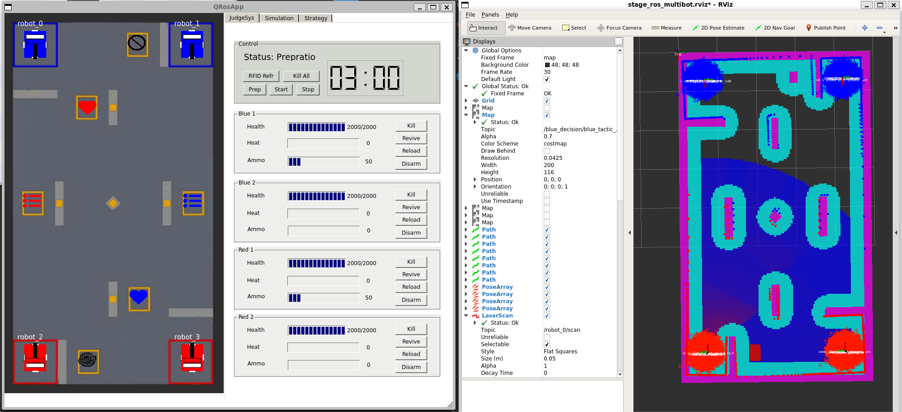
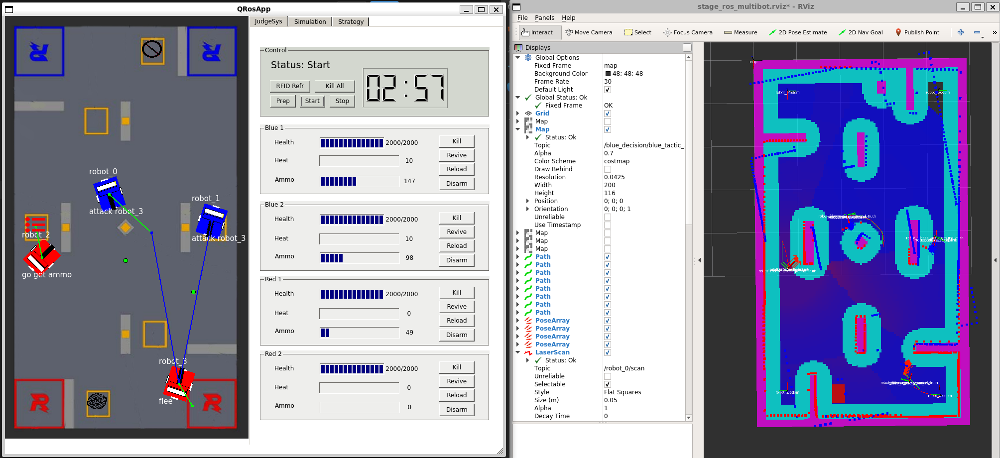

# PB-RMSentryDecisionSimulation（PB-RMSDS）

## 1. 项目介绍
本项目基于 [哈工大（威海）2020RMUA-ICRA挑战赛开源项目](https://github.com/chalkchalk/1CRA_HER0) 修改，计划中的项目包括：升级为ROS2、增加强化学习博弈对抗训练功能、根据RMUL和RMUC规则完善裁判系统模拟部分、提供更多地图选择等等。原项目效果视频传送门：[哈尔滨工业大学（威海）HERO战队ICRA2020人工智能挑战赛技术报告视频](https://www.bilibili.com/video/BV11U4y1a7tW?vd_source=ba34da388d14a6cc3e50840d02f1c4ea)

## 2. 环境搭建
当前开发分支为 ROS1 kinetic，暂时修改为完善为新版本catkin和qt环境下可运行版本。

### docker-ros开发容器部署

考虑到现有流行的ubuntu版本，这里使用docker-ros来进行部署和运行，运行小鱼的一键部署docker-ros开发容器，按照提示选择该ros版本进行开发容器的部署

```
wget [http://fishros.com/install](http://fishros.com/install) -O fishros && bash fishros
```
### 安装依赖包和库

```
sudo apt-get update
sudo apt-get install protobuf-compiler
sudo apt-get install ros-kinetic-libg2o
sudo apt install libgoogle-glog-dev
sudo apt install qt4-default
sudo apt install ros-kinetic-slam-gmapping
sudo apt install ros-kinetic-map-server
```

## 3. 编译与启动

### 编译


```
catkin_make
```

如果出现编译失败可能是性能问题，多编译几次就好

### 运行

```
source devel/setup.bash
roslaunch hero_multistage stage_bringup.launch
```
### 运行效果




